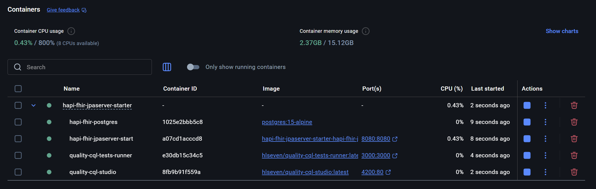
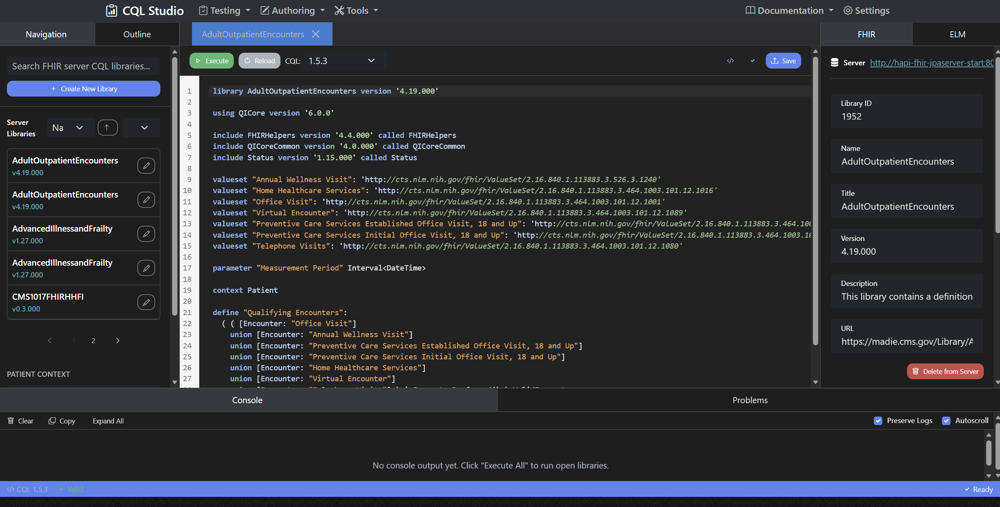

# **HAPI-FHIR CQL Starter Project**

This is a modified repo of the original [HAPI FHIR Starter](https://github.com/hapifhir/hapi-fhir-jpaserver-starter) project. Please visit that repo for information regarding configurations options. It is intended to deploy a local HAPI FHIR Server environment with the CQL test runner, CQL Studio Project, and 2025 eCQM Content Package.

## **Setup - Running as Docker**

### **» Step 1 – Clone repo and repo submodules**

```sh
git clone https://github.com/Zachary-Higgins-Altera/hapi-fhir-cql-starter.git
git submodule update --init --recursive
# (Optional) Retrieve Maven Packages
mvn clean install -DskipTests
```


### **» Step 2 – Docker Compose**

Run the following command from the cloned repo: 
``` sh
docker compose up -d --build

# To skip deploying CQL Studio, use the following...
docker compose -f docker-compose.nocomposer.yml up -d --build
```

## **Reference**

### **Docker Containers**
The following docker containers will be deployed:
- **HAPI FHIR Postgres Backend** - https://github.com/hapifhir/hapi-fhir-jpaserver-starter
- **HAPI FHIR JpaServer** - https://github.com/hapifhir/hapi-fhir-jpaserver-starter
- **CQL Test Runner** - https://github.com/cqframework/cql-tests & https://github.com/cqframework/cql-tests-runner
- **CQL Studio** - https://github.com/cqframework/cql-studio



-------------------------------

### **Application Services/Ports**
The following services will be available:
- **HAPI FHIR Server** - TCP 8080 (HTTP)
- **HAPI Postgres** - TCP 5432 (JDBC)
- **CQL Test Runner** - TCP 3000 (HTTP)
- **CQL Studio** - TCP 4200 (HTTP)

-------------------------------

### **Using (and not using) CQL Studio**
CQL Studio is a fully functional IDE environment for authoring CQL. In addition, it has the capability to integrate with an oLlama model for authoring assistance and troubleshooting. This repo does not cover configuring the AI assistant. This GUI is not required for production deployments.



-------------------------------

### **Submodules**
The following submodules were added to this repo (you do not need to run these commands again):

``` bash
git submodule add https://github.com/cqframework/cql-tests-runner.git
git submodule add https://github.com/cqframework/cql-studio.git
git submodule update --init --recursive
```